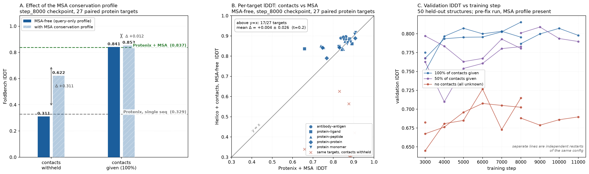

# Folding from contacts instead of MSAs — results so far

**Status:** exploratory, results are from a *warm-started* model and use
**oracle contacts** (derived from the ground-truth structure). See
[Caveats](#caveats) before quoting any number.

Design doc and full research record:
[`.agents/project/20260806_contact_conditioned_folding.md`](.agents/project/20260806_contact_conditioned_folding.md).

---

## The question

Helico is an AlphaFold3 clone. AF3-family models lean heavily on multiple
sequence alignments: strip the MSA and accuracy collapses. MSAs are also the
expensive, slow, and least biologically satisfying part of the pipeline.

[MarinFold](https://github.com/Open-Athena/MarinFold) predicts residue–residue
side-chain contacts directly. So: **can a folding model take contacts as input
instead of an MSA, and reach the same accuracy?**

If yes, the alignment search comes out of the critical path and is replaced by a
contact predictor.

## What was built

- A three-state token×token contact matrix — `PRESENT` / `ABSENT` / `UNKNOWN` —
  computed by [pyconfind](https://github.com/Open-Athena/pyconfind) with the
  exact `contacts-v1` parameters MarinFold uses
  ([`src/helico/contacts.py`](src/helico/contacts.py)).
- The matrix is embedded and added into the pair representation `z_init`
  through a zero-initialised projection, so an untrained contact pathway is an
  exact no-op and warm starting from a Protenix checkpoint is lossless.
- Training samples the conditioning level per example — all-unknown, fully
  specified, and everything between — so one model serves any level of contact
  knowledge, including none.
- The MSA input is gated off (`use_msa=False`) for all runs here.
- Validation reports lDDT at 0%, 50%, 100%, and 100%-with-noise conditioning
  every validation step.

## Headline result

**Given the true contact map, a genuinely MSA-free model matches
Protenix-with-MSAs.**



FoldBench, 27 protein targets scored by every arm (paired — same targets, same
scoring pipeline). Helico rows are MSA-free: no alignment, no conservation
profile.

| Arm | lDDT |
| --- | --- |
| Protenix v1, single sequence | 0.329 |
| **Helico, contacts all-unknown** | **0.311** |
| Protenix v1, with MSAs | 0.837 |
| **Helico, contacts given (100%)** | **0.841** |

Paired differences:

| Comparison | Δ lDDT | t | improved |
| --- | --- | --- | --- |
| Helico: contacts off → on | **+0.530 ± 0.028** | 19.1 | 26/27 |
| Helico contacts-on vs Protenix + MSA | +0.004 ± 0.026 | 0.2 | 17/27 |
| Protenix: single sequence → +MSA | +0.508 ± 0.024 | 21.2 | 27/27 |

MSAs are worth +0.508 lDDT to Protenix on these targets. Oracle contacts recover
that from a model with no alignment at all, and the residual gap to
Protenix+MSA is not distinguishable from zero.

Controls:

- **Empirical null.** 11 nucleic-acid-only targets have no protein contacts, so
  the two arms are identical by construction. Measured: +0.0004 (sd 0.026).
- **Zero-init no-op.** At step 0 the arms differ by +0.004 ± 0.005 (t=0.9) — no
  contact information reaches the model before training.
- **Dead contact pathway.** A run whose contact projection never learned shows
  contacts off→on of +0.003 ± 0.003 (t=1.1, n.s.), so oracle contacts leak
  nothing through any route other than `linear_contact`.
- **No benchmark overlap.** 0 of 236,326 manifest entries lack a `release_date`,
  and 0 of the 49 FoldBench targets appear among the 168,102 train-eligible
  structures.

## Two bugs that mattered

### The contact pathway could not learn

The contact projection is zero-initialised, and at the shared learning rate of
5e-5 **it never moved**. The first ~15k steps of training and the entire depth
sweep — about $1,100 of compute — measured a model that was ignoring its
contacts entirely, while reporting plausible-looking losses.

The fix is a per-parameter-group learning-rate multiplier
(`--contact-lr-multiplier=1000`); the contact weight norm then climbs to ~55 and
plateaus. `train/contact_weight_norm` is now logged every step so a dead
pathway is visible immediately rather than after a week of runs.

### `use_msa=False` did not disable MSAs

`use_msa` gated the MSA *module*. But `msa_profile` and `deletion_mean` — the
per-column conservation profile and insertion rate — live in `s_inputs`,
outside that module, and `build_s_inputs` read them unconditionally. Both
training ([`train.py`](src/helico/train.py) globbed the MSA tar indices
regardless of the flag) and benchmarking
([`modal/bench.py`](modal/bench.py) set `msa_server_url` unconditionally)
supplied them from real alignments.

So every "MSA-free" number before this fix was produced by a model receiving a
PSSM-style profile: for each residue, the frequency of all 32 residue classes
across up to 512 homologs, plus the mean insertion count. That encodes
conservation, tolerated substitutions, and gap structure — enough on its own for
secondary-structure and burial prediction. It does *not* contain co-evolution,
which is second-order and lives in the alignment's joint statistics.

Measured cost of the leak at step_8000:

| | with profile | MSA-free | Δ |
| --- | --- | --- | --- |
| contacts withheld | 0.622 | 0.311 | **+0.311 ± 0.021** (t=14.9) |
| contacts given | 0.853 | 0.841 | +0.012 ± 0.013 (t=0.9, n.s.) |

Two consequences. The apparent contact effect was understated — off→on is
+0.530 MSA-free, not +0.234 — because the profile was propping up the
contacts-withheld arm. And once the true contact map is supplied, the profile
adds nothing: contacts subsume the first-order conservation signal.

The fix gates `profile`/`deletion_mean` on `use_msa` in `build_s_inputs`, with
both `Helico.forward` call sites forwarding `config.use_msa`.
`TestNoMSALeak` poisons every MSA-derived batch key at once and asserts the
trunk output is unchanged, so a future feature that reintroduces alignment
information fails the suite.

### "Single sequence" meant three different things

Three distinct configurations were all being called "no MSA":

| | what it does | Protenix v1 lDDT |
| --- | --- | --- |
| `single_sequence_msa` | depth-1 MSA, row 0 = the query; module runs | **0.327** |
| `empty_msa` | depth-1 MSA of *gaps*; module runs | — |
| `use_msa=False` | MSA module never runs | 0.244 |

The first published single-sequence baseline here used the third: it removed a
module whose update the pairformer weights were trained to expect every
recycling iteration. That is a lesion, not a starved input, and it understated
Protenix by +0.082 ± 0.022 (t=3.80). The corrected baseline is 0.327.

This mattered because it made a fine-tuned model look like it beat a baseline it
was never fairly compared against. It does not affect the headline
contacts-off-vs-on result, which is same-checkpoint and paired.

## What did not hold up

The original proposal was to *also* shrink the trunk — the intuition being that
explicit contacts do the work the deep pairformer stack was doing implicitly.
That is wrong, at least under warm start: 48 blocks (0.815 val lDDT, +0.139
contact gain) beats 8 and 16 blocks (~0.66, ~+0.07) decisively. Explicit
contacts do not substitute for trunk depth.

This is confounded — every arm inherits Protenix's 48-block weights, which
favours the 48-block arm. A from-scratch sweep is still open.

## Caveats

These matter, and none of them are resolved yet.

0. **Trained with the profile.** The checkpoint above was *trained* with the
   MSA profile present and only *evaluated* without it, so the MSA-free numbers
   carry a train/test mismatch working against them. A retrain under the gate
   is pending.
1. **Oracle contacts.** Contacts are computed from the ground-truth structure,
   so they leak the answer. This measures *structure realisation given a
   correct contact map*, not structure prediction. It is the right first
   experiment — it establishes the ceiling — but it is not comparable to
   published AF3/Protenix numbers, and the Protenix rows in the table above are
   genuine predictions while the Helico contacts-on row is not. The open
   question is how much accuracy survives *predicted* contacts, which is a
   sweep over false-positive/false-negative rates that has not been run.
2. **Warm start.** All runs initialise from Protenix v1, which was trained with
   MSAs. The model is being adapted, not trained from scratch.
3. **Fine-tuned vs zero-shot.** The Helico rows are fine-tuned; the Protenix
   rows are zero-shot. Only the same-checkpoint contacts off-vs-on comparison
   isolates contacts.
4. **The noise model is not yet realistic.** See
   [Conditioning schedule](#conditioning-schedule-and-noise-model).
5. **The MSA module still exists.** `use_msa=False` removes the MSA *input*;
   the module is still constructed (~3M dead parameters). Deliberate for now, to
   keep warm starting simple.
6. **The 8000-step point is from a different run** than the 0-3000
   trajectory, so it is not directly comparable to it. See
   [Training progress](#training-progress).

## Training progress

Panel A is a single run (`contacts-lrmult1000`), so it is a real trajectory.
Step 0 is the warm start itself — Protenix v1 weights with `use_msa=False` and
the contact projection still at its zero initialisation.

| step | contacts given | contacts withheld |
| --- | --- | --- |
| 0 | 0.249 | 0.244 |
| 1000 | 0.820 | 0.557 |
| 2000 | 0.832 | 0.592 |
| 3000 | 0.837 | 0.560 |
| 8000 *(different run)* | 0.850 | 0.616 |

Almost all of the movement happens in the first 1000 steps; steps 1000 → 3000
add +0.017 with contacts given.

**Step 0 doubles as a control.** The contact projection is zero-initialised, so
conditioning should be an exact no-op there and the two arms should coincide.
Measured difference: **+0.0045 ± 0.0047 (t=0.96)** — consistent with zero. The
warm start is lossless and the pipeline is not leaking contact information
through some other path.

The in-training validation (panel C) covers steps 3000–9000 on a different
evaluation set and is flat over that range: averaged across the two runs with
full coverage, lDDT at 100% conditioning goes 0.759 (3000) → 0.795 (4000) →
0.801 (5000) → 0.805 (8000), while independent restarts at matched steps differ
by up to 0.029.

An earlier claim in this work — that a +0.013 FoldBench gain between two
checkpoints showed training was still helping — does not survive. Those
checkpoints came from different runs, and the effect is smaller than the
run-to-run spread.

## Conditioning schedule and noise model

What training samples per example ([`contacts.py`](src/helico/contacts.py)):

| mode | share | what it does |
| --- | --- | --- |
| `none` | 15% | everything unknown |
| `full` | 15% | every eligible pair specified |
| `pair-subset` | 35% | reveal a fraction of *pairs*, rest unknown |
| `contact-list` | 35% | reveal a fraction of *contacts*; unlisted pairs become absent or unknown on a coin flip |

`reveal ~ U(0,1)`; false-positive and false-negative rates `eps_fp, eps_fn ~
U(0, 0.3)` independently, both expressed as a fraction of revealed contacts.

Known problems with this, in rough priority order:

1. **False positives land where a predictor cannot produce them.** The FP
   candidate set is every non-contact pair in the upper triangle, unrestricted.
   Measured on a synthetic complex: **~40% of injected FPs are structurally
   impossible** — 8.7% at `|i-j| < 6` (which the pipeline filters out of the
   true set) and 31% on non-protein tokens (pyconfind only emits protein
   side-chain contacts). The model can learn to discount exactly those, so its
   apparent robustness to noise is inflated. FPs should be drawn from the same
   eligible region as true contacts, and preferentially from near-miss pairs
   (CB-CB just beyond the contact threshold) rather than uniformly.
2. **`eps_fp` and `eps_fn` are independent.** Real predictors move along a
   precision/recall tradeoff; independent uniforms spend mass on corners that
   do not occur. They should be sampled from a curve, and the range should be
   set from MarinFold's measured operating point rather than an arbitrary 0.3.
3. **`@contacts50` is not "half the information".** `pair-subset` at 0.5
   specifies half of *all pairs* — and since contacts are ~0.1% of pairs, that
   asserts a very large number of true negatives. This is why the 50% level
   tracks close to 100% rather than sitting midway. A contact-list partial
   (reveal half the contacts, rest unknown) is the more meaningful "partial".
4. **Revealed contacts are a uniform random subset.** A predictor finds
   high-confidence contacts preferentially. pyconfind already returns a
   *degree* per contact, currently thresholded and discarded — weighting reveal
   probability by degree would model this.
5. **Errors are independent.** Real predictor errors are spatially correlated;
   a mispredicted region gets many wrong contacts at once.
6. **No validation level matches a real operating point.** Levels are 0/50/100
   and 100-with-20%-noise. One level pinned to MarinFold's measured precision
   and recall would track deployment readiness directly.

## Reproducing

```bash
uv run python .agents/project/figures/contact_conditioning_accuracy.py
```

Benchmark arms (oracle contacts on/off) are produced by `modal/bench.py`:

```bash
HELICO_BENCH_ORACLE_CONTACTS=1 modal run --detach modal/bench.py --checkpoint /ckpts/<run>/step_8000.pt --output-dir bench_on
```

Protenix single-sequence uses `HELICO_BENCH_SINGLE_SEQ=1` (depth-1 MSA whose one
row is the query). `HELICO_BENCH_NO_MSA=1` is a *different*, harsher ablation
that removes the MSA module outright — see
["Single sequence" meant three different things](#single-sequence-meant-three-different-things).

## Open questions

1. **How accurate must contacts be?** The sweep over false-positive/false-negative
   rates that decides whether MarinFold-predicted contacts can drive this.
2. **Depth from scratch**, to remove the warm-start confound.
3. **Do partial contacts help proportionally?** 50% conditioning currently sits
   much closer to 100% than to 0% — worth understanding.
