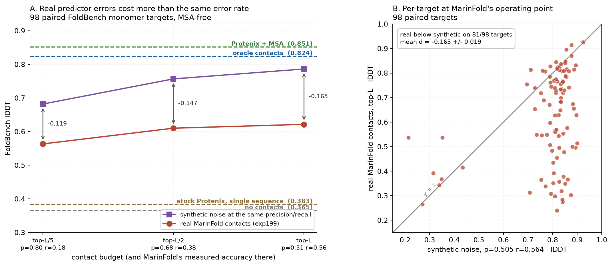
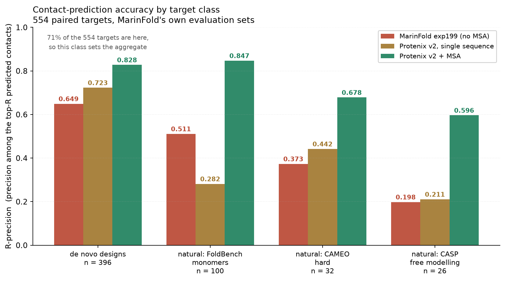

# Folding from contacts instead of MSAs — results so far

**Status:** exploratory. Results below are from a *warm-started* model.

Every number here uses **MarinFold predicted contacts** (or, where labelled,
oracle contacts from the ground-truth structure as a ceiling). Earlier versions of
this document led with synthetic contacts — the ground-truth map degraded with a
uniform noise model. Those numbers were an upper bound that did not transfer, and
they have been removed.

Weights: [timodonnell/helico](https://huggingface.co/timodonnell/helico)
(`contacts-msafree-01`, step 6000 — the checkpoint every number below describes).

Design doc and full research record:
[`.agents/project/20260806_contact_conditioned_folding.md`](.agents/project/20260806_contact_conditioned_folding.md).

---

## The question

Helico is an AlphaFold3 clone. AF3-family models lean heavily on multiple
sequence alignments: strip the MSA and accuracy collapses. MSAs are also the
expensive, slow, and least biologically satisfying part of the pipeline.

[MarinFold](https://github.com/Open-Athena/MarinFold) predicts residue–residue
side-chain contacts directly. So: **can a folding model take contacts as input
instead of an MSA, and reach the same accuracy?**

If yes, the alignment search comes out of the critical path and is replaced by a
contact predictor.

## What was built

- A three-state token×token contact matrix — `PRESENT` / `ABSENT` / `UNKNOWN` —
  computed by [pyconfind](https://github.com/Open-Athena/pyconfind) with the
  exact `contacts-v1` parameters MarinFold uses
  ([`src/helico/contacts.py`](src/helico/contacts.py)).
- The matrix is embedded and added into the pair representation `z_init`
  through a zero-initialised projection, so an untrained contact pathway is an
  exact no-op and warm starting from a Protenix checkpoint is lossless.
- Training samples the conditioning level per example — all-unknown, fully
  specified, and everything between — so one model serves any level of contact
  knowledge, including none.
- The MSA input is gated off (`use_msa=False`) for all Helico runs here: no
  alignment and no conservation profile, at training or inference.
- Validation reports lDDT at several conditioning levels every validation step.

## Headline result

**Predicted contacts beat the strongest single-sequence baseline by a wide
margin, and do not yet reach MSAs.** The margin depends on MarinFold supplying a
better contact map than Protenix v2 does, which holds on this target class and
not on all of them — see
[the R-precision reconciliation](#reconciling-with-marinfolds-own-r-precision-comparison).



91 paired FoldBench monomer targets. Contacts come from MarinFold
`contacts-v1-exp199-1.5B` via
[MarinFold exp211](https://github.com/Open-Athena/MarinFold/issues/211)'s
rollouts, aggregated by vote across 100 rollouts and truncated to a top-k list.

Protenix v1 **and** v2 appear as baselines, each with and without MSAs. v2 runs
through the **official ByteDance implementation** (`protenix==2.0.0`, model
`protenix-v2`) rather than Helico's reimplementation, since v2 changes the
architecture. Both v2 arms use Protenix's own recommended inference settings
(5 samples / 10 cycles / 200 steps) — more compute than the Helico arms get at
3 samples / 6 cycles, which deliberately favours the baseline.

| arm | MSA? | lDDT |
| --- | --- | --- |
| Helico, no contacts | no | 0.368 |
| Protenix v1, single sequence | no | 0.386 |
| Helico + contacts read off v2's single-seq structure | no | 0.404 |
| **Protenix v2, single sequence** | no | **0.409** |
| Helico + single rollout, top-L | no | 0.566 |
| **Helico + MarinFold, top-L/5** | no | **0.575** |
| **Helico + MarinFold, top-L/2** | no | **0.626** |
| **Helico + MarinFold, top-L** | no | **0.638** |
| Protenix v1 + MSA | **yes** | 0.855 |
| Helico + oracle contacts | no | 0.862 |
| **Protenix v2 + MSA** | **yes** | **0.865** |

| comparison | Δ lDDT | t | better on |
| --- | --- | --- | --- |
| Protenix v2 vs v1, single sequence | +0.023 ± 0.011 | 2.2 | 51/91 |
| Protenix v2 vs v1, with MSA | +0.010 ± 0.004 | 2.5 | 60/91 |
| **MarinFold vs v2 single sequence** | **+0.229 ± 0.022** | 10.4 | 76/91 |
| **v2 + MSA vs MarinFold** | **+0.227 ± 0.019** | 11.8 | 87/91 |
| **v2 + MSA vs oracle contacts** | +0.004 ± 0.006 | 0.6 | 59/91 |

Three things follow.

**Predicted contacts beat the strongest single-sequence baseline.** v2 is genuinely
better than v1 without MSAs (+0.023), and MarinFold contacts still clear it
by **+0.229 ± 0.022** on 76 of 91 targets. It holds at every contact budget, and
even a single un-aggregated rollout beats it.

**They still do not reach MSAs.** v2+MSA leads predicted contacts by
**+0.227 ± 0.019** on 87 of 91.

**Oracle contacts match the best MSA model.** v2+MSA vs oracle is
+0.004 ± 0.006 — indistinguishable. A perfect contact map is worth as much as an
alignment to the best available model, so nothing about the approach caps out
below MSAs; **the entire shortfall is contact quality**.

The control that makes the first claim credible: **our own contacts-off arm
scores 0.368, below Protenix v2's 0.409** (−0.042 ± 0.008, t=−5.0). The fine-tuned model
has no intrinsic advantage in the no-information condition — if anything it gave
up a little single-sequence capability during contact fine-tuning. All of the
+0.229 comes from the contacts.

Other controls:

- **Empirical null.** Nucleic-acid-only targets have no protein contacts, so the
  arms are identical by construction. Measured: +0.0004 (sd 0.026).
- **Zero-init no-op.** At step 0 the arms coincide — see
  [Training progress](#training-progress).
- **No benchmark overlap.** 0 of the FoldBench targets appear among the 168,102
  train-eligible structures.

## What we benchmark on, and how it was chosen

FoldBench is far larger than this subset. The full chain:

| stage | targets |
| --- | --- |
| FoldBench, all categories | 1823 |
| `monomer_protein` category | 334 |
| MarinFold exp211's `foldbench100` subset (the targets predicted contacts exist for) | 100 |
| index map verified end-to-end (2 dropped: sequences would not align) | 98 |
| Protenix +MSA arm needs a pre-computed a3m (7 dropped) | **91** |

All arms are restricted to the common 91 so every comparison stays paired. The
full target list is in
[`experiments/marinfold_contacts/arms/targets.csv`](experiments/marinfold_contacts/arms/targets.csv).

The 100 were **not** chosen by this project: `foldbench100` is MarinFold exp89's
standing evaluation set, fixed long before this experiment existed, and exp211
simply reran the current model on it. Checked for selection bias against the 236
unselected monomers: lengths match (median 227 vs 226).

Monomers only, so these numbers are not comparable to the assembly-set results
reported in earlier revisions of this document.

## Is MarinFold actually supplying better contacts?

If Protenix v2's own single-sequence structure already implies contacts as good
as MarinFold's, then the gain would be Helico extracting more from equivalent
information rather than the contact map being better. Measured directly: run
Protenix v2 in single-sequence mode, run pyconfind on its predicted structure,
and feed *those* contacts to Helico.

| contact source | precision | recall | contacts emitted |
| --- | --- | --- | --- |
| Protenix v2 single-seq structure → pyconfind | 0.261 | 0.263 | 270 |
| MarinFold exp199, top-L | **0.505** | **0.564** | 265 |

(against 261 true contacts per target on average — a like-for-like budget.)

MarinFold is ~1.9× more precise at ~2.1× the recall. And feeding the
v2-derived contacts to Helico gives **0.404**, versus **0.409** for Protenix v2
itself — a deficit of 0.006 ± 0.001. Helico recovers essentially all of v2's
accuracy from a contact map read off v2's own output, and adds nothing on top of
it: it faithfully tracks contact quality. So the gain over single-sequence
folding is the contact map, not the folding model.

### Reconciling with MarinFold's own R-precision comparison

MarinFold's internal evaluations report its models as on par with — or slightly
worse than — Protenix v2 single sequence at contact recapitulation, which appears
to contradict the 1.9× above. Both are correct. The aggregate is a mean over a
target mix that is 71% designed proteins, and the two methods rank differently by
target class.



R-precision (precision among the top-R predictions, R = the true contact count),
554 targets scored by every arm, taken verbatim from MarinFold's own experiment
outputs: exp199's rows for MarinFold, exp74's for Protenix v2. Protenix contacts
are read off its predicted structure with pyconfind — the same route used for the
v2-derived control above.

| target class | n | MarinFold exp199 | Protenix v2, single seq | Protenix v2 + MSA | MarinFold − v2 SS |
| --- | --- | --- | --- | --- | --- |
| de novo designs (`denovo_pdb`) | 396 | 0.649 | **0.723** | 0.828 | −0.074 ± 0.014 |
| natural: FoldBench monomers | 100 | **0.511** | 0.282 | 0.847 | **+0.230 ± 0.027** |
| natural: CAMEO hard | 32 | 0.373 | **0.442** | 0.678 | −0.069 ± 0.054 |
| natural: CASP free modelling | 26 | 0.198 | 0.211 | 0.596 | −0.013 ± 0.026 |
| **pooled** | **554** | 0.587 | 0.603 | 0.812 | −0.016 ± 0.013 |

The pooled row is the reported tie, and it is dominated by `denovo_pdb` — 71% of
the targets, and the one class where Protenix v2 single sequence is much the
better contact predictor. Designed proteins are idealised and highly regular, and
a structure predictor handles them well without an alignment.

**The advantage is confined to `foldbench100`, and "natural vs designed" does not
explain it.** MarinFold wins there by +0.230, but loses on CAMEO hard (−0.069)
and ties on CASP free modelling (−0.013) — both natural sets. What separates
`foldbench100` from those two is difficulty and novelty: CAMEO hard and CASP FM
are selected for low homology and novel folds, and MarinFold degrades sharply on
them (0.373 and 0.198, against 0.511). So the honest statement is narrower than
"natural proteins": *MarinFold supplies better contacts than Protenix v2 single
sequence on ordinary, well-represented natural PDB monomers, and not elsewhere.*

That is a real scope limitation on the folding result, since `foldbench100` is
exactly the set it is measured on. It is not a discrepancy between the two
measurements: the independent measurement here (0.261 for v2 SS on this set)
matches MarinFold's own exp74 measurement of 0.282 within the difference in
target subset (91 vs 100), and the pipelines agree.

Two further notes from the same data:

- **Protenix's distogram head is the wrong place to read contacts from.**
  Single-sequence distogram R-precision is 0.434 / 0.227 / 0.321 / 0.210 across
  the four classes — below the structure-derived numbers everywhere. Running
  pyconfind on the predicted structure is the stronger baseline, and it is the
  one used throughout.
- **With an MSA, Protenix v2 is far ahead of everything on every class**
  (0.596–0.847). Contact prediction is not where the alignment stops mattering.

## Training-set contamination

MarinFold's training corpora were checked for homologs of the 98 benchmark
targets with mmseqs (not the earlier coarse check, which reported 2/98 and was
wrong).

AFDB distillation corpus: **76/98 targets have a homolog at ≥25% identity, 27 at
≥50%**. But identity does not predict accuracy — r = −0.044 between a target's
best homolog identity and its lDDT — and dropping every target with a ≥50%
homolog *strengthens* the headline (+0.2587 vs +0.229). The ESM-Atlas scan is
still running.

## The index map, which nearly broke this

MarinFold indexes residues into the published prompt (full SEQRES); the bench
derives its sequence from the *resolved* residues of the ground truth. Only 15 of
100 targets agree outright. 83 agree once prompt positions are mapped through
exp211's `resolved` list; 2 need real alignment and were dropped. A naive
identity map would have shifted contacts on 83% of targets and produced a
plausible-looking "real contacts underperform" answer for entirely the wrong
reason.

Verified by round trip: exp211's ground truth pushed through the map reproduces
helico's own `oracle_contact_state` at mean Jaccard 0.998 (min 0.984), pinned by
`tests/test_marinfold_export.py`.

## Training progress


A checkpoint sweep of `contacts-msafree-01` on the same 91 targets, so it is
directly comparable to everything above. Each checkpoint is benched with
MarinFold contacts, with oracle contacts, and with contacts withheld.

| step | contacts withheld | MarinFold, top-L | oracle |
| --- | --- | --- | --- |
| 0 *(warm start)* | 0.310 | 0.307 | 0.307 |
| 1000 | 0.362 | 0.626 | 0.829 |
| 2000 | — | 0.629 | 0.848 |
| 3000 | — | 0.637 | 0.855 |
| 5000 | — | 0.637 | 0.861 |
| final | 0.368 | 0.638 | 0.862 |

**Step 0 is the control.** It is the warm start itself — Protenix v1 weights with
`use_msa=False` and the contact projection still at its zero initialisation, so
conditioning is an exact no-op and all three arms must coincide. They do: the
spread across the three is **0.003**, and oracle-vs-withheld is
−0.004 ± 0.003 (t=−1.1). The warm start is lossless and nothing leaks contact
information through another path.

**Almost all of the learning happens in the first 1000 steps.** Steps 1000 →
final add +0.012 ± 0.004 (t=3.3) with predicted contacts and +0.033 with oracle ones —
real and small, but the pathway is essentially trained within one thousand steps.

The contacts-withheld arm rises from 0.310 to 0.368 over the same span. That is
not contact learning: step 0 is the harsher `use_msa=False` lesion (see
["Single sequence" meant three different things](#single-sequence-meant-three-different-things)),
and fine-tuning recovers part of what removing the MSA module cost. It ends
*below* both Protenix single-sequence baselines, which is the control that keeps
the contact effect attributable to contacts.

At the final checkpoint, MarinFold contacts are worth **+0.270 ± 0.021** (t=12.8) over
the same weights with contacts withheld, on 83 of 91 targets.


## Two bugs that mattered

### The contact pathway could not learn

The contact projection is zero-initialised, and at the shared learning rate of
5e-5 **it never moved**. The first ~15k steps of training and the entire depth
sweep — about $1,100 of compute — measured a model that was ignoring its
contacts entirely, while reporting plausible-looking losses.

The fix is a per-parameter-group learning-rate multiplier
(`--contact-lr-multiplier=1000`); the contact weight norm then climbs to ~55 and
plateaus. `train/contact_weight_norm` is now logged every step so a dead
pathway is visible immediately rather than after a week of runs.

### `use_msa=False` did not disable MSAs

`use_msa` gated the MSA *module*. But `msa_profile` and `deletion_mean` — the
per-column conservation profile and insertion rate — live in `s_inputs`,
outside that module, and `build_s_inputs` read them unconditionally. Both
training ([`train.py`](src/helico/train.py) globbed the MSA tar indices
regardless of the flag) and benchmarking
([`modal/bench.py`](modal/bench.py) set `msa_server_url` unconditionally)
supplied them from real alignments.

So every "MSA-free" number before this fix was produced by a model receiving a
PSSM-style profile: for each residue, the frequency of all 32 residue classes
across up to 512 homologs, plus the mean insertion count. That encodes
conservation, tolerated substitutions, and gap structure — enough on its own for
secondary-structure and burial prediction. It does *not* contain co-evolution,
which is second-order and lives in the alignment's joint statistics.

Measured cost of the leak at step_8000:

| | with profile | MSA-free | Δ |
| --- | --- | --- | --- |
| contacts withheld | 0.622 | 0.311 | **+0.311 ± 0.021** (t=14.9) |
| contacts given | 0.853 | 0.841 | +0.012 ± 0.013 (t=0.9, n.s.) |

Two consequences. The apparent contact effect was understated — because the
profile was propping up the contacts-withheld arm. And once the contact map is
supplied, the profile adds nothing: contacts subsume the first-order conservation
signal.

The fix gates `profile`/`deletion_mean` on `use_msa` in `build_s_inputs`, with
both `Helico.forward` call sites forwarding `config.use_msa`.
`TestNoMSALeak` poisons every MSA-derived batch key at once and asserts the
trunk output is unchanged, so a future feature that reintroduces alignment
information fails the suite.

### "Single sequence" meant three different things

Three distinct configurations were all being called "no MSA":

| | what it does | Protenix v1 lDDT |
| --- | --- | --- |
| `single_sequence_msa` | depth-1 MSA, row 0 = the query; module runs | **0.327** |
| `empty_msa` | depth-1 MSA of *gaps*; module runs | — |
| `use_msa=False` | MSA module never runs | 0.244 |

The first published single-sequence baseline here used the third: it removed a
module whose update the pairformer weights were trained to expect every
recycling iteration. That is a lesion, not a starved input, and it understated
Protenix by +0.082 ± 0.022 (t=3.80). The corrected baseline is 0.327.

This mattered because it made a fine-tuned model look like it beat a baseline it
was never fairly compared against. It does not affect the same-checkpoint,
paired contacts-off-vs-on result.

## What did not hold up

The original proposal was to *also* shrink the trunk — the intuition being that
explicit contacts do the work the deep pairformer stack was doing implicitly.
That is wrong, at least under warm start: 48 blocks (0.815 val lDDT, +0.139
contact gain) beats 8 and 16 blocks (~0.66, ~+0.07) decisively. Explicit
contacts do not substitute for trunk depth.

This is confounded — every arm inherits Protenix's 48-block weights, which
favours the 48-block arm. A from-scratch sweep is still open.

## Caveats

1. **Warm start.** All runs initialise from Protenix v1, which was trained with
   MSAs. The model is being adapted, not trained from scratch.
2. **Fine-tuned vs zero-shot.** The Helico rows are fine-tuned; the Protenix
   rows are zero-shot. Only the same-checkpoint contacts off-vs-on comparison
   isolates contacts. The contacts-off control (below Protenix v2) bounds how
   much the fine-tuning itself could be worth.
3. **Monomers only.** Not comparable to the assembly-set numbers in earlier
   revisions, and untested on complexes.
4. **The contact-quality advantage is confined to this target class.** On
   MarinFold's own evaluation sets it beats Protenix v2 single sequence on
   `foldbench100` by +0.230 R-precision, but *loses* on designed proteins
   (−0.074) and on CAMEO hard (−0.069), and ties on CASP free modelling. The
   folding result is measured on `foldbench100`, so it inherits that limit
   directly and should not be read as a general claim. See
   [the R-precision reconciliation](#reconciling-with-marinfolds-own-r-precision-comparison).
5. **Training false positives are drawn uniformly**, while real predictor errors
   cluster near true contacts. The model has never been trained against the
   error distribution it actually faces. See
   [Conditioning schedule](#conditioning-schedule).
6. **The MSA module still exists.** `use_msa=False` removes the MSA *input*;
   the module is still constructed (~3M dead parameters). Deliberate for now, to
   keep warm starting simple.

## The validation set is sequence-contaminated

Use FoldBench numbers, not validation numbers, for anything absolute.

The train/val split is purely temporal (train < 2021-09-30, val
2022-05-01..2023-01-12, the AF3 convention). That removes almost no sequence
redundancy, because the PDB constantly re-deposits the same protein. Measured
against the 236k-entry manifest:

- **38.2%** of validation structures have a chain sequence appearing *verbatim*
  in training
- **18.4%** have every chain verbatim in training

Consequence, measured on one checkpoint:

| | val `@contacts0` | FoldBench, contacts off |
| --- | --- | --- |
| `contacts-msafree-01` step 500 | 0.680 | 0.289 |
| Protenix, single sequence | — | 0.329 |

The validation number is largely recall of memorised folds: given a sequence
seen in training, the model does not need conservation signal to place the
backbone. That is why removing the MSA profile cost +0.311 on FoldBench and
nothing at all on validation.

Between-level comparisons still hold — all conditioning levels score identical
structures under a fixed seed, so the conditioning *curve* is paired and
meaningful. It is the absolute values that are inflated.

## Conditioning schedule

What training samples per example ([`contacts.py`](src/helico/contacts.py)):

| mode | share | what it does |
| --- | --- | --- |
| `none` | 15% | everything unknown |
| `full` | 15% | every eligible pair specified |
| `pair-subset` | 35% | reveal a fraction of *pairs*, rest unknown |
| `contact-list` | 35% | MarinFold-shaped: a truncated top-k contact list |

MarinFold's operating point (2026-08) is **~60% precision, ~60% recall**, output
as a truncated top-k list. Three things were wrong for that and are now fixed:

1. **False positives landed where a predictor cannot produce them.** The FP
   candidate set was the whole upper triangle. Measured: **~40% of injected FPs
   were structurally impossible** — 8.7% at `|i-j| < 6` (filtered out of the
   true set) and 31% on non-protein tokens (pyconfind emits protein side-chain
   contacts only). That gave the model a free "this one is fake" cue that will
   not exist at deployment. FPs are now restricted to the eligible region;
   measured impossible FPs after the fix: **0**.
2. **A top-k list cannot assert absence.** `contact-list` previously flipped a
   coin and marked all unlisted eligible pairs ABSENT half the time. With
   truncation, an unlisted pair means "did not make the cut", which is
   uninformative — asserting millions of true negatives the predictor never
   claimed. Unlisted pairs now stay unknown.
3. **The sampled range never reached the real operating point.** `eps_fp` counts
   false contacts relative to revealed ones, so precision `p` needs
   `eps_fp = (1-p)/p`. At p=0.6 that is **0.667**, well outside the old
   `U(0, 0.3)` — which corresponds to precision ≥ 0.77. The model had never
   been trained anywhere near where it has to work. `contact-list` now samples
   a precision in `[0.4, 1.0]` and derives `eps_fp`.

`conditioning_from_precision_recall(p, r)` converts an operating point into
`(reveal, eps_fp, eps_fn)`; recall loss folds into `reveal` because a top-k list
has no separate "reported but wrong" channel.

Remaining known gaps, not yet addressed:

- **False positives are uniform within the eligible region.** Real ones
  concentrate near true contacts (near-miss pairs just beyond the distance
  threshold), where they are geometrically plausible and cannot be rejected as
  inconsistent with the rest of the map. **This is the cheapest available
  lever, and it is on our side rather than MarinFold's.**
- **Revealed contacts are a uniform random subset.** A predictor finds
  high-confidence contacts first. pyconfind returns a *degree* per contact,
  currently thresholded and discarded — weighting reveal probability by degree
  would model this.
- **Errors are independent.** Real predictor errors are spatially correlated.
- **`@contacts50` is not "half the information".** `pair-subset` at 0.5
  specifies half of *all pairs*, and since contacts are ~0.1% of pairs that
  asserts a very large number of true negatives. This is why the 50% level
  tracks close to 100% rather than sitting midway.

## Reproducing

```bash
uv run python .agents/project/figures/marinfold_real_contacts.py
uv run python .agents/project/figures/contact_conditioning_accuracy.py
```

Benchmark arms are produced by `modal/bench.py`:

```bash
HELICO_BENCH_CONTACTS_ARM=rollout_L modal run --detach modal/bench.py --checkpoint /ckpts/contacts-msafree-01/final.pt --output-dir bench_real
```

`HELICO_BENCH_ORACLE_CONTACTS=1` substitutes the ground-truth contact map.
Protenix single-sequence uses `HELICO_BENCH_SINGLE_SEQ=1` (depth-1 MSA whose one
row is the query). `HELICO_BENCH_NO_MSA=1` is a *different*, harsher ablation
that removes the MSA module outright — see
["Single sequence" meant three different things](#single-sequence-meant-three-different-things).

Protenix v2 baselines run through ByteDance's own implementation:
`modal/bench_protenix_v2.py`.

## Open questions

1. **Retrain with structured false positives** — sample training FPs from
   near-miss pairs rather than uniformly, so the model is trained against the
   error distribution it actually faces.
2. **How accurate must contacts be?** The measured points are top-L/5 (p=0.80,
   r=0.18) → 0.575, top-L/2 (0.68/0.38) → 0.626, top-L (0.51/0.56) → 0.638.
   Locating the knee sets how much predictor headroom is worth chasing.
3. **Depth from scratch**, to remove the warm-start confound
   ([helico#12](https://github.com/Open-Athena/helico/issues/12)).
4. **Complexes.** Everything here is monomers.
