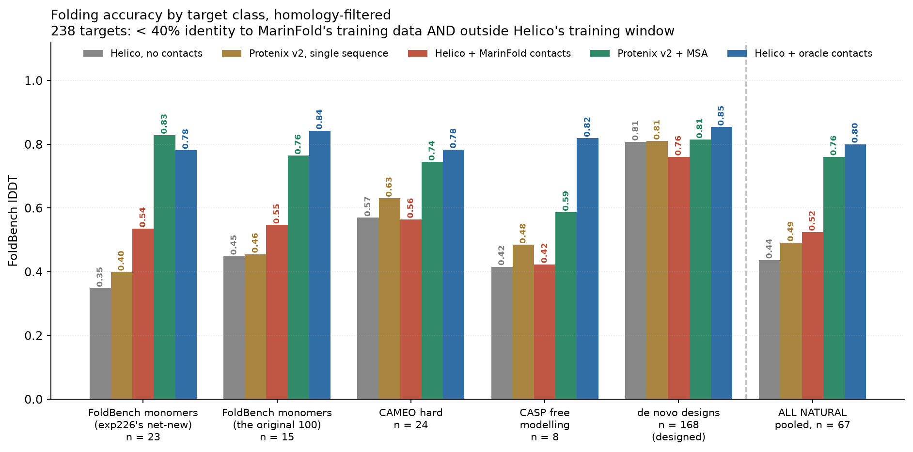

# Folding from contacts instead of MSAs — results so far

**Status:** exploratory. Results below are from a *warm-started* model.

> **Superseded for the headline comparison.**
> [exp14](experiments/exp14_foldbench_held_out_monomers/) re-ran this question on
> MarinFold [exp245](https://github.com/Open-Athena/MarinFold/tree/main/experiments/exp245_evals_foldbench_held_out_monomers)'s
> held-out FoldBench monomer sets: **333 proteins instead of 38**, none released
> inside Helico's training window, with contacts from a checkpoint whose
> training corpus was provably decontaminated against them. Every claim below
> reproduces there and most get larger:
>
> | | here (38 targets) | exp14 (210 held-out) |
> | --- | --- | --- |
> | MarinFold contacts vs Protenix-v2 single sequence | +0.119 ± 0.031 | **+0.218 [+0.192, +0.245]** |
> | MarinFold contacts vs contacts withheld | +0.152 ± 0.032 | **+0.255 [+0.231, +0.280]** |
> | oracle contacts vs Protenix-v2 + MSA | −0.002 ± 0.028 | **0.860 vs 0.860** |
>
> exp14 also answers what this document could not: lDDT tracks the *precision*
> of the contacts (r = 0.81–0.97) almost independently of which model produced
> them, and Helico's own folding is flat at 0.861 across homology and viral
> strata that move the contact predictor by 0.05. The numbers in this document
> remain correct for the 38-target homology-filtered set they describe.

**Every number here is homology-filtered.** A target is reported only if it
survives both of:

| filter | what it removes |
| --- | --- |
| **MarinFold homology** ([exp226](https://github.com/Open-Athena/MarinFold/issues/226)'s `eval2`) | anything with ≥ 40% identity to either MarinFold training arm — 4.1M AFDB + 66.8M ESM-Atlas, mmseqs `-s 7.5`, hit counted iff evalue ≤ 1e-3 and qcov ≥ 0.50 |
| **Helico training window** | anything released before 2021-09-30, Helico's training cutoff |

Neither is optional. The first leaves targets Helico trained on; the second
leaves targets whose fold MarinFold has effectively memorised.

**An earlier version of this document led with +0.229 lDDT over Protenix v2
single sequence on 91 FoldBench monomers. Only 15 of the original FoldBench 100
clear the homology filter, so that number is withdrawn** — it is reported here
only as the size of the contamination effect. The filtered result is +0.091.

Contacts come from **`contacts-v1-exp199-cooldown-1.5B`**, MarinFold's default
since [exp238](https://github.com/Open-Athena/MarinFold/pull/239) — vote-aggregated
across 100 rollouts and truncated to a top-k list. It is worth
**+0.028 ± 0.013 lDDT** over the checkpoint it replaced, measured on these same
targets through the same folding model.

Weights: [timodonnell/helico](https://huggingface.co/timodonnell/helico)
(`contacts-msafree-01`, step 6000 — the checkpoint every number below describes).

Design doc and full research record:
[`.agents/project/20260806_contact_conditioned_folding.md`](.agents/project/20260806_contact_conditioned_folding.md).
Slides: [`.agents/project/slides/contact_conditioned_folding.pdf`](.agents/project/slides/contact_conditioned_folding.pdf).

---

## The question

Helico is an AlphaFold3 clone. AF3-family models lean heavily on multiple
sequence alignments: strip the MSA and accuracy collapses. MSAs are also the
expensive, slow, and least biologically satisfying part of the pipeline.

[MarinFold](https://github.com/Open-Athena/MarinFold) predicts residue–residue
side-chain contacts directly. So: **can a folding model take contacts as input
instead of an MSA, and reach the same accuracy?**

If yes, the alignment search comes out of the critical path and is replaced by a
contact predictor.

## What was built

- A three-state token×token contact matrix — `PRESENT` / `ABSENT` / `UNKNOWN` —
  computed by [pyconfind](https://github.com/Open-Athena/pyconfind) with the
  exact `contacts-v1` parameters MarinFold uses
  ([`src/helico/contacts.py`](src/helico/contacts.py)).
- The matrix is embedded and added into the pair representation `z_init`
  through a zero-initialised projection, so an untrained contact pathway is an
  exact no-op and warm starting from a Protenix checkpoint is lossless.
- Training samples the conditioning level per example — all-unknown, fully
  specified, and everything between — so one model serves any level of contact
  knowledge, including none.
- The MSA input is gated off (`use_msa=False`) for all Helico runs here: no
  alignment and no conservation profile, at training or inference.
- Validation reports lDDT at several conditioning levels every validation step.

## Headline result

**Predicted contacts beat the strongest single-sequence baseline, and a perfect
contact map is worth as much as an alignment.** Both on targets neither model
has memorised.

The headline set is the FoldBench monomers that clear both filters: exp226's 23
net-new plus the 15 survivors of the original 100, **n = 38**. CAMEO hard and
CASP free modelling are benched and reported
[by class](#where-the-gain-exists-and-where-it-does-not) but excluded here —
their depositions fall inside Protenix v2's training window, so its baselines on
them read high in a way the FoldBench slices do not.

| arm | MSA? | lDDT | 95% CI |
| --- | --- | --- | --- |
| Helico, no contacts | no | 0.388 | [0.340, 0.443] |
| **Protenix v2, single sequence** | no | **0.421** | [0.375, 0.470] |
| Helico + MarinFold, top-L/5 | no | 0.491 | |
| Helico + MarinFold, top-L/2 | no | 0.538 | |
| **Helico + MarinFold, top-L** | no | **0.540** | [0.481, 0.599] |
| **Protenix v2 + MSA** | **yes** | **0.803** | [0.765, 0.837] |
| Helico + oracle contacts | no | 0.806 | [0.749, 0.850] |

Per-arm intervals are 95% percentile bootstrap over 10,000 resamples of the 38
targets, every arm on the same resample.

| comparison | Δ lDDT | 95% CI | better on |
| --- | --- | --- | --- |
| **MarinFold contacts vs Protenix v2 single sequence** | **+0.119 ± 0.031** | [+0.059, +0.178] | 28/38 |
| MarinFold contacts vs the same weights, contacts withheld | +0.152 ± 0.032 | [+0.090, +0.215] | 25/38 |
| MarinFold's new default vs the checkpoint it replaced | +0.028 ± 0.013 | [+0.004, +0.054] | 26/38 |
| Protenix v2 + MSA vs MarinFold contacts | +0.263 ± 0.035 | [+0.196, +0.330] | 32/38 |
| **Protenix v2 + MSA vs oracle contacts** | **−0.002 ± 0.028** | [−0.052, +0.056] | 14/38 |

Intervals are 95% percentile bootstrap on the *per-target difference*, 10,000
resamples of the 38 targets. Every arm sees the same resample, so the
comparisons stay paired; a per-arm CI on the means themselves is roughly twice
as wide (e.g. MarinFold contacts 0.513 [0.455, 0.571]) and is not the right
interval for a difference.

Three things follow.

**Contacts beat the strongest single-sequence model**, by +0.119 ± 0.031 on 28
of 38 targets. This is like-for-like: both see one sequence and no alignment.

**Oracle contacts match Protenix v2 + MSA** — −0.002 ± 0.028, indistinguishable.
A perfect contact map is worth as much as an alignment *on exactly the targets
where alignments are hardest to build*, which is a stronger version of this claim
than the unfiltered set could support. Nothing about the approach caps out below
MSAs; **the entire shortfall is contact quality**.

**They do not yet reach MSAs.** Protenix v2 + MSA leads real contacts by
+0.291 ± 0.035.

The control that makes the first claim credible: **our own contacts-off arm
scores 0.388, below Protenix v2's 0.421** (−0.033 ± 0.014). The fine-tuned model
has no intrinsic advantage in the no-information condition, so the gain is the
contacts, not the fine-tuning.

### Where the gain exists, and where it does not



All 238 doubly-filtered targets, five arms each.

| class | n | no contacts | v2 single seq | + MarinFold | v2 + MSA | oracle |
| --- | --- | --- | --- | --- | --- | --- |
| FoldBench, exp226 net-new | 23 | 0.348 | 0.399 | **0.495** | 0.829 | 0.781 |
| FoldBench, original-100 survivors | 15 | 0.449 | 0.455 | **0.539** | 0.764 | 0.843 |
| CAMEO hard | 24 | 0.570 | **0.631** | 0.553 | 0.745 | 0.783 |
| CASP free modelling | 8 | 0.416 | **0.485** | 0.383 | 0.587 | 0.819 |
| de novo designs | 168 | 0.807 | 0.810 | 0.751 | 0.815 | 0.854 |
| **natural, pooled** | **67** | 0.437 | 0.491 | 0.500 | 0.761 | 0.800 |

**The gain needs both a weak single-sequence baseline and accurate contacts, and
only the FoldBench slices have both.** De novo designs have no headroom — Helico
scores 0.807 with no contacts at all, because designed backbones are idealised
and regular. CAMEO hard and CASP FM have plenty of headroom (oracle is worth
+0.21 and +0.40 there) but MarinFold's contacts are too inaccurate to claim it:
R-precision 0.38 and 0.20, against 0.41–0.44 on FoldBench.

Pooled over all 67 filtered natural targets, contacts are worth +0.063 ± 0.020
against no contacts but only **+0.009 ± 0.022 against Protenix v2 single
sequence** — a tie. That mirrors exp226's own contact-level finding on the same
targets (+0.011 ± 0.029 R-precision), which is the strongest evidence in this
project that **the folding model transmits contact quality faithfully**: it wins
where the contacts are better and loses where they are worse, at almost exactly
the measured margin.

### How many contacts should be emitted

| set | no contacts | top-L/5 | top-L/2 | top-L |
| --- | --- | --- | --- | --- |
| FoldBench (n=38) | 0.388 | 0.480 | 0.508 | **0.513** |
| natural, pooled (n=67) | 0.437 | **0.505** | 0.505 | 0.500 |
| designed (n=171) | 0.808 | 0.792 | 0.767 | 0.752 |

On FoldBench more contacts is better. Pooled over natural targets the trend
flattens and reverses, and on designed proteins **every extra contact costs
accuracy monotonically**. At ~0.4 precision the highest-voted fifth carries most
of the true contacts and the tail adds false positives faster than true ones.
The unfiltered analysis showed a clean monotone gain to top-L and is what made
top-L the default; the right truncation depends on precision, and precision
varies sharply by target class.

Other controls:

- **Empirical null.** Nucleic-acid-only targets have no protein contacts, so the
  arms are identical by construction. Measured: +0.0004 (sd 0.026).
- **Zero-init no-op.** At step 0 the arms coincide — see
  [Training progress](#training-progress).
- **Independent pipeline agreement.** The by-class results run through
  `modal/bench_byclass.py` against ground truths converted from MarinFold's own
  PDB copies — a completely separate path from `modal/bench.py`. On the same
  FoldBench targets the two agree to within 0.01 lDDT.

## What we benchmark on, and why it is this small

| stage | targets |
| --- | --- |
| FoldBench monomers (exp12's 100 + exp226's 234) | 334 |
| contacts and ground truth available (MarinFold exp211 / exp226) | 123 |
| outside Helico's training window (released ≥ 2021-09-30) | 123 |
| **< 40% identity to MarinFold's training data (exp226 `eval2`)** | **38** |

**85% of the original FoldBench 100 has a ≥ 40% homolog in MarinFold's training
data**; 15 survive. exp226's 23 net-new monomers are all natural and all clear
the filter, which is why they nearly double the usable set.

The 38 headline targets, with per-arm lDDT and each one's best identity to
MarinFold's training data, are in
[`byclass/data/headline_38_targets.csv`](experiments/marinfold_contacts/byclass/data/headline_38_targets.csv).

The 100 were not chosen by this project — `foldbench100` is MarinFold exp89's
standing evaluation set, fixed long before this experiment existed. The 234
net-new are the rest of FoldBench's `monomer_protein.csv` at exp12's pinned
commit.

Beyond FoldBench, 200 further targets clear both filters and are reported by
class: 24 CAMEO hard, 8 CASP free modelling, 168 de novo designs. The full list
with per-target filter flags is in
[`experiments/marinfold_contacts/byclass/data/targets.csv`](experiments/marinfold_contacts/byclass/data/targets.csv).

Monomers only.

## Is MarinFold actually supplying better contacts?

If Protenix v2's own single-sequence structure already implied contacts as good
as MarinFold's, the gain would be Helico extracting more from equivalent
information rather than the contact map being better. It does not. R-precision
on exp226's `eval2`, the same homology filter:

| target class | n | Protenix v2 single seq | MarinFold exp199 | Protenix v2 + MSA |
| --- | --- | --- | --- | --- |
| FoldBench, exp226 net-new | 23 | 0.243 | **0.407** | 0.805 |
| FoldBench, original-100 survivors | 15 | 0.385 | **0.440** | 0.763 |
| CAMEO hard | 24 | **0.525** | 0.381 | 0.697 |
| CASP free modelling | 19 | **0.215** | 0.201 | 0.546 |
| de novo designs | 226 | **0.798** | 0.613 | 0.804 |
| **natural, pooled** | **78** | 0.326 | 0.337 | 0.698 |

MarinFold leads on both FoldBench slices — by +0.164 ± 0.052 and +0.055 ± 0.036 —
and those are exactly the slices where the folding gain appears. It loses on
designs and CAMEO hard, and those are exactly where folding loses too. The
folding model transmits contact quality; it does not add or subtract much of its
own.

A direct version of the same control was run on the *unfiltered* 91-target set:
contacts read off Protenix v2's single-sequence structure with pyconfind scored
0.261 precision against MarinFold's 0.505 at a matched budget, and feeding those
v2-derived contacts to Helico reproduced Protenix v2's own lDDT to within
0.006. Those numbers are on targets the homology filter removes and are not part
of the headline, but the conclusion — Helico adds nothing on top of a contact
map, it tracks it — is the same one the filtered table above supports.

### Reconciling with MarinFold's own R-precision comparison

MarinFold's internal evaluations report its models as on par with — or slightly
worse than — Protenix v2 single sequence at contact recapitulation, which appears
to contradict the FoldBench rows above. Both are correct: the aggregate is
dominated by designed proteins.


**74% of `eval2` is designed protein** (226 of 307), and that is the one class
where Protenix v2 single sequence is much the better contact predictor — 0.798
against 0.613. Pooled, that produces a near-tie, and on the natural subset the
tie is genuine (0.337 vs 0.326). The disagreement is entirely composition.

This is the load-bearing scope limit on the whole result: **MarinFold supplies
better contacts than Protenix v2 single sequence on natural FoldBench monomers,
and not on designed proteins or on the hardest natural sets.** The folding result
inherits that limit exactly, which is why it is reported on FoldBench and broken
out by class everywhere else.

## Training-set contamination

Handled by construction rather than as a caveat: every number in this document
is restricted to
[exp226's `eval2`](https://github.com/Open-Athena/MarinFold/issues/226), which
searched all 776 candidate targets against **both** MarinFold training arms —
4.13M AFDB (AlphaFold2 labels) and 66.76M ESM-Atlas (ESMFold2 distillation) —
with mmseqs `-s 7.5`, counting a hit only at evalue ≤ 1e-3 and qcov ≥ 0.50.

Two findings from that search are worth carrying over:

- **Checking one corpus alone overcounts survivors by ~3×.** Among the 222
  net-new FoldBench monomers, AFDB alone would have kept 76 and ESM-Atlas alone
  62; against both, 23 survive. The arms are complementary, not redundant, and
  every earlier overlap check in either project looked at AFDB only.
- **FoldBench is the dirtiest slice available**: 85% of it fails a 40% filter,
  against 43% of the de novo designs.

An earlier in-house check reported that 76 of 98 FoldBench targets had an AFDB
homolog at ≥ 25% identity while identity did not predict accuracy (r = −0.044).
That analysis is superseded: it covered one arm, one threshold, and a target set
that is no longer the reporting set.

## The index map, which nearly broke this

MarinFold indexes residues into the published prompt (full SEQRES); the bench
derives its sequence from the *resolved* residues of the ground truth. Only 15 of
100 targets agree outright. 83 agree once prompt positions are mapped through
exp211's `resolved` list; 2 need real alignment and were dropped. A naive
identity map would have shifted contacts on 83% of targets and produced a
plausible-looking "real contacts underperform" answer for entirely the wrong
reason.

Verified by round trip: exp211's ground truth pushed through the map reproduces
helico's own `oracle_contact_state` at mean Jaccard 0.998 (min 0.984), pinned by
`tests/test_marinfold_export.py`.

## Training progress


A checkpoint sweep of `contacts-msafree-01`, restricted to the 11 FoldBench
monomers that clear the homology filter and are paired across every checkpoint
and reference arm. Small, but the alternative is a training curve measured on
targets MarinFold has memorised.

| step | contacts withheld | MarinFold, top-L | oracle |
| --- | --- | --- | --- |
| 0 *(warm start)* | 0.362 | 0.368 | 0.364 |
| 1000 | 0.489 | 0.587 | 0.818 |
| 2000 | — | 0.585 | 0.853 |
| 3000 | — | 0.596 | 0.858 |
| 5000 | — | 0.586 | 0.860 |
| final | 0.485 | 0.595 | 0.859 |

**Step 0 is the control.** It is the warm start itself — Protenix v1 weights with
`use_msa=False` and the contact projection still at its zero initialisation, so
conditioning is an exact no-op and all three arms must coincide. They do: the
spread is **0.004**, and oracle-vs-withheld is +0.004 ± 0.008 (n.s.). The warm
start is lossless and nothing leaks contact information through another path.

**Almost all of the learning happens in the first 1000 steps.** Steps 1000 →
final add +0.009 ± 0.007 with predicted contacts — the pathway is essentially
trained within one thousand steps.

The contacts-withheld arm rises from 0.362 to 0.485 over the same span. That is
not contact learning: step 0 is the harsher `use_msa=False` lesion (see
["Single sequence" meant three different things](#single-sequence-meant-three-different-things)),
and fine-tuning recovers part of what removing the MSA module cost. It ends
*below* both Protenix single-sequence baselines, which is the control that keeps
the contact effect attributable to contacts.

At the final checkpoint, contacts are worth **+0.110 ± 0.048** (t=2.3) over the
same weights with contacts withheld, and oracle contacts a further +0.264.

## Two bugs that mattered

### The contact pathway could not learn

The contact projection is zero-initialised, and at the shared learning rate of
5e-5 **it never moved**. The first ~15k steps of training and the entire depth
sweep — about $1,100 of compute — measured a model that was ignoring its
contacts entirely, while reporting plausible-looking losses.

The fix is a per-parameter-group learning-rate multiplier
(`--contact-lr-multiplier=1000`); the contact weight norm then climbs to ~55 and
plateaus. `train/contact_weight_norm` is now logged every step so a dead
pathway is visible immediately rather than after a week of runs.

### `use_msa=False` did not disable MSAs

`use_msa` gated the MSA *module*. But `msa_profile` and `deletion_mean` — the
per-column conservation profile and insertion rate — live in `s_inputs`,
outside that module, and `build_s_inputs` read them unconditionally. Both
training ([`train.py`](src/helico/train.py) globbed the MSA tar indices
regardless of the flag) and benchmarking
([`modal/bench.py`](modal/bench.py) set `msa_server_url` unconditionally)
supplied them from real alignments.

So every "MSA-free" number before this fix was produced by a model receiving a
PSSM-style profile: for each residue, the frequency of all 32 residue classes
across up to 512 homologs, plus the mean insertion count. That encodes
conservation, tolerated substitutions, and gap structure — enough on its own for
secondary-structure and burial prediction. It does *not* contain co-evolution,
which is second-order and lives in the alignment's joint statistics.

Measured cost of the leak at step_8000:

| | with profile | MSA-free | Δ |
| --- | --- | --- | --- |
| contacts withheld | 0.622 | 0.311 | **+0.311 ± 0.021** (t=14.9) |
| contacts given | 0.853 | 0.841 | +0.012 ± 0.013 (t=0.9, n.s.) |

Two consequences. The apparent contact effect was understated — because the
profile was propping up the contacts-withheld arm. And once the contact map is
supplied, the profile adds nothing: contacts subsume the first-order conservation
signal.

The fix gates `profile`/`deletion_mean` on `use_msa` in `build_s_inputs`, with
both `Helico.forward` call sites forwarding `config.use_msa`.
`TestNoMSALeak` poisons every MSA-derived batch key at once and asserts the
trunk output is unchanged, so a future feature that reintroduces alignment
information fails the suite.

### "Single sequence" meant three different things

Three distinct configurations were all being called "no MSA":

| | what it does | Protenix v1 lDDT |
| --- | --- | --- |
| `single_sequence_msa` | depth-1 MSA, row 0 = the query; module runs | **0.327** |
| `empty_msa` | depth-1 MSA of *gaps*; module runs | — |
| `use_msa=False` | MSA module never runs | 0.244 |

The first published single-sequence baseline here used the third: it removed a
module whose update the pairformer weights were trained to expect every
recycling iteration. That is a lesion, not a starved input, and it understated
Protenix by +0.082 ± 0.022 (t=3.80). The corrected baseline is 0.327.

This mattered because it made a fine-tuned model look like it beat a baseline it
was never fairly compared against. It does not affect the same-checkpoint,
paired contacts-off-vs-on result.

## What did not hold up

**The headline shrank by two thirds under homology filtering.** +0.229 lDDT over
Protenix v2 single sequence on 91 unfiltered FoldBench monomers became +0.091 on
the 38 that clear a 40% identity filter against MarinFold's training data. The
direction survives and the oracle ceiling survives; the magnitude does not, and
neither does the claim on natural proteins pooled, which is a tie.

**The contact-budget conclusion reversed.** The unfiltered set showed a clean
monotone gain out to top-L, which is why top-L is the default arm. On filtered
natural targets the trend flattens and reverses, and on designed proteins every
extra contact costs accuracy. See
[How many contacts should be emitted](#how-many-contacts-should-be-emitted).

The original proposal was to *also* shrink the trunk — the intuition being that
explicit contacts do the work the deep pairformer stack was doing implicitly.
That is wrong, at least under warm start: 48 blocks (0.815 val lDDT, +0.139
contact gain) beats 8 and 16 blocks (~0.66, ~+0.07) decisively. Explicit
contacts do not substitute for trunk depth.

This is confounded — every arm inherits Protenix's 48-block weights, which
favours the 48-block arm. A from-scratch sweep is still open.

## Caveats

1. **Warm start.** All runs initialise from Protenix v1, which was trained with
   MSAs. The model is being adapted, not trained from scratch.
2. **Fine-tuned vs zero-shot.** The Helico rows are fine-tuned; the Protenix
   rows are zero-shot. Only the same-checkpoint contacts off-vs-on comparison
   isolates contacts. The contacts-off control (below Protenix v2) bounds how
   much the fine-tuning itself could be worth.
3. **Monomers only.** Not comparable to the assembly-set numbers in earlier
   revisions, and untested on complexes.
4. **The advantage is confined to natural FoldBench monomers.** MarinFold's
   contacts beat Protenix v2 single sequence there and lose on designed
   proteins, CAMEO hard, and CASP free modelling — and the folding result wins
   and loses in exactly the same places. Read the headline as a claim about that
   target class, not about proteins in general. See
   [the R-precision reconciliation](#reconciling-with-marinfolds-own-r-precision-comparison).
5. **n = 38 in the headline.** Homology filtering is what costs the sample size.
   The effect is large relative to its standard error (t = 3.3), but this is a
   small set and the per-class breakdowns are smaller still — CASP FM is n = 8.
6. **Training false positives are drawn uniformly**, while real predictor errors
   cluster near true contacts. The model has never been trained against the
   error distribution it actually faces. See
   [Conditioning schedule](#conditioning-schedule).
7. **The MSA module still exists.** `use_msa=False` removes the MSA *input*;
   the module is still constructed (~3M dead parameters). Deliberate for now, to
   keep warm starting simple.

## The validation set is sequence-contaminated

Use FoldBench numbers, not validation numbers, for anything absolute.

The train/val split is purely temporal (train < 2021-09-30, val
2022-05-01..2023-01-12, the AF3 convention). That removes almost no sequence
redundancy, because the PDB constantly re-deposits the same protein. Measured
against the 236k-entry manifest:

- **38.2%** of validation structures have a chain sequence appearing *verbatim*
  in training
- **18.4%** have every chain verbatim in training

Consequence, measured on one checkpoint:

| | val `@contacts0` | FoldBench, contacts off |
| --- | --- | --- |
| `contacts-msafree-01` step 500 | 0.680 | 0.289 |
| Protenix, single sequence | — | 0.329 |

The validation number is largely recall of memorised folds: given a sequence
seen in training, the model does not need conservation signal to place the
backbone. That is why removing the MSA profile cost +0.311 on FoldBench and
nothing at all on validation.

Between-level comparisons still hold — all conditioning levels score identical
structures under a fixed seed, so the conditioning *curve* is paired and
meaningful. It is the absolute values that are inflated.

## Conditioning schedule

What training samples per example ([`contacts.py`](src/helico/contacts.py)):

| mode | share | what it does |
| --- | --- | --- |
| `none` | 15% | everything unknown |
| `full` | 15% | every eligible pair specified |
| `pair-subset` | 35% | reveal a fraction of *pairs*, rest unknown |
| `contact-list` | 35% | MarinFold-shaped: a truncated top-k contact list |

The model was trained for an operating point of **~60% precision, ~60% recall**,
output as a truncated top-k list — MarinFold's measured accuracy on the
unfiltered evaluation set at the time (2026-08). **On homology-filtered targets
its actual precision at top-L is ~0.40**, so the training distribution is
centred above where the model is asked to work. Three things were wrong even for
60/60 and are now fixed:

1. **False positives landed where a predictor cannot produce them.** The FP
   candidate set was the whole upper triangle. Measured: **~40% of injected FPs
   were structurally impossible** — 8.7% at `|i-j| < 6` (filtered out of the
   true set) and 31% on non-protein tokens (pyconfind emits protein side-chain
   contacts only). That gave the model a free "this one is fake" cue that will
   not exist at deployment. FPs are now restricted to the eligible region;
   measured impossible FPs after the fix: **0**.
2. **A top-k list cannot assert absence.** `contact-list` previously flipped a
   coin and marked all unlisted eligible pairs ABSENT half the time. With
   truncation, an unlisted pair means "did not make the cut", which is
   uninformative — asserting millions of true negatives the predictor never
   claimed. Unlisted pairs now stay unknown.
3. **The sampled range never reached the real operating point.** `eps_fp` counts
   false contacts relative to revealed ones, so precision `p` needs
   `eps_fp = (1-p)/p`. At p=0.6 that is **0.667**, well outside the old
   `U(0, 0.3)` — which corresponds to precision ≥ 0.77. The model had never
   been trained anywhere near where it has to work. `contact-list` now samples
   a precision in `[0.4, 1.0]` and derives `eps_fp`.

`conditioning_from_precision_recall(p, r)` converts an operating point into
`(reveal, eps_fp, eps_fn)`; recall loss folds into `reveal` because a top-k list
has no separate "reported but wrong" channel.

Remaining known gaps, not yet addressed:

- **The sampled operating point is optimistic.** Training centres on 60%
  precision; homology-filtered MarinFold delivers ~40%. Together with the
  uniform-FP problem below, the model has been trained for an easier input than
  it receives.
- **False positives are uniform within the eligible region.** Real ones
  concentrate near true contacts (near-miss pairs just beyond the distance
  threshold), where they are geometrically plausible and cannot be rejected as
  inconsistent with the rest of the map. **This is the cheapest available
  lever, and it is on our side rather than MarinFold's.**
- **Revealed contacts are a uniform random subset.** A predictor finds
  high-confidence contacts first. pyconfind returns a *degree* per contact,
  currently thresholded and discarded — weighting reveal probability by degree
  would model this.
- **Errors are independent.** Real predictor errors are spatially correlated.
- **`@contacts50` is not "half the information".** `pair-subset` at 0.5
  specifies half of *all pairs*, and since contacts are ~0.1% of pairs that
  asserts a very large number of true negatives. This is why the 50% level
  tracks close to 100% rather than sitting midway.

## Open questions

1. **Improve contact accuracy on natural proteins.** That is the entire gap:
   R-precision on the filtered natural set is 0.337 against a ceiling of 1.0,
   and oracle contacts already match Protenix v2 + MSA.
2. **Retrain with structured false positives** — sample training FPs from
   near-miss pairs rather than uniformly, so the model is trained against the
   error distribution it actually faces.
3. **Revisit the emitted budget.** top-L is best on FoldBench, but the trend
   reverses pooled over natural targets and every extra contact costs accuracy
   on designs. The right truncation depends on precision, which varies by class
   — so the emitted budget probably should too.
4. **Depth from scratch**, to remove the warm-start confound
   ([helico#12](https://github.com/Open-Athena/helico/issues/12)).
5. **Complexes.** Everything here is monomers.

## Reproducing

```bash
uv run python .agents/project/figures/folding_by_dataset.py
uv run python .agents/project/figures/contact_accuracy_by_dataset.py
uv run python .agents/project/figures/contact_conditioning_accuracy.py
uv run python .agents/project/slides/make_slides.py
```

The by-class target set is rebuilt with, in order,
`experiments/marinfold_contacts/byclass/`'s `build_targets.py`,
`export_contacts.py`, and `add_foldbench_rest.py`; arms are run with
`modal/bench_byclass.py` and the Protenix baselines with
`modal/bench_protenix_v2.py --targets-file ... --gt-dir ...`, then scored by
`byclass/score_protenix_byclass.py`.
