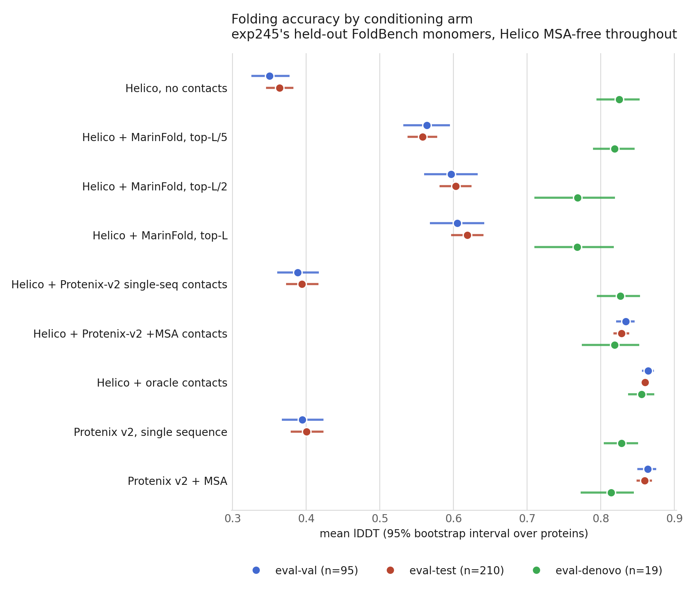
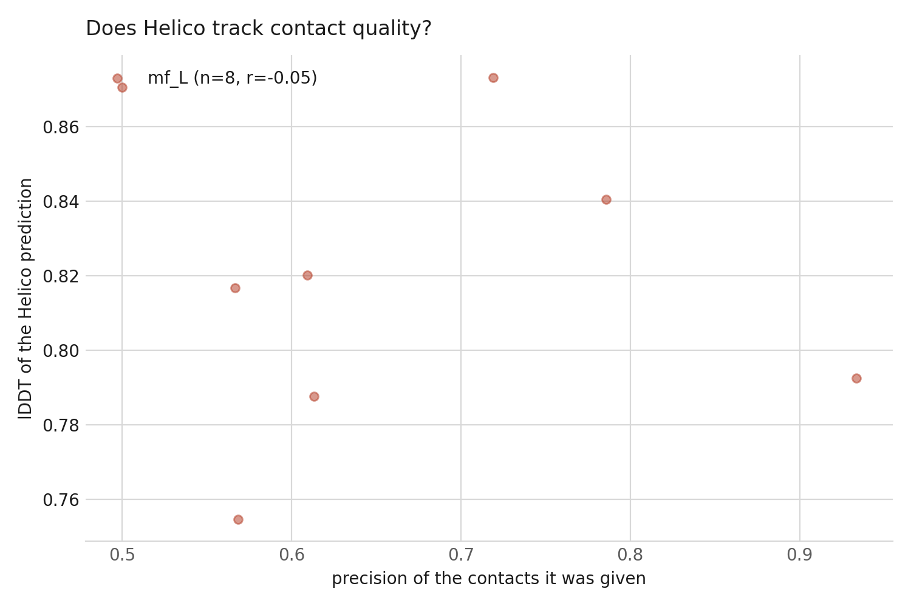
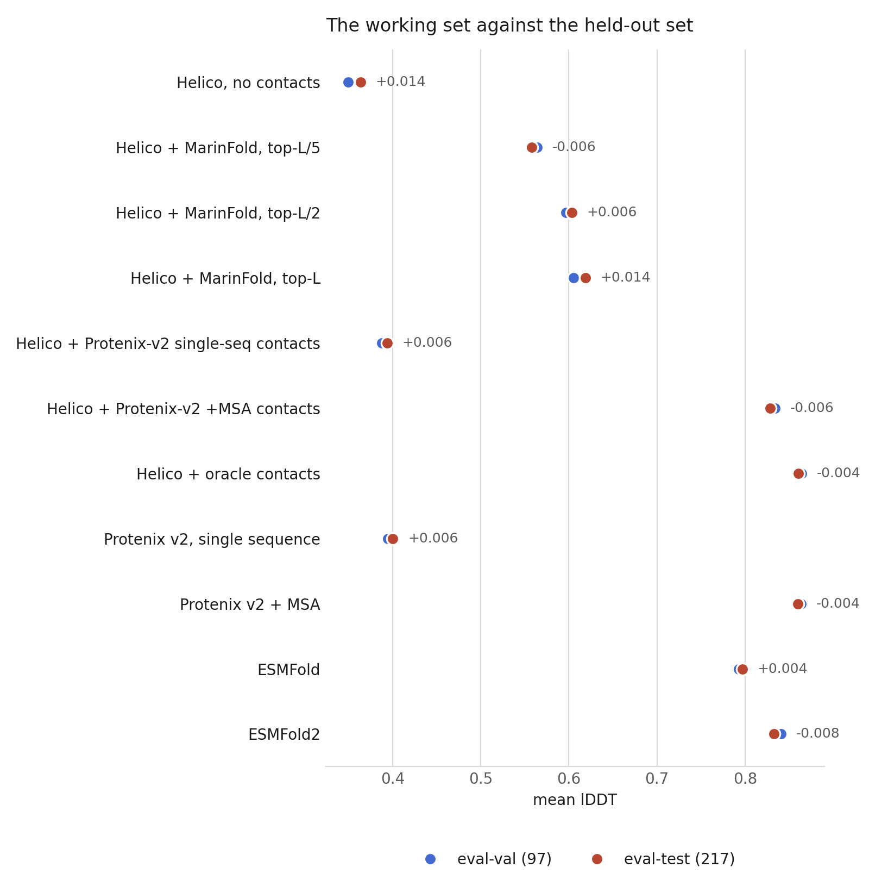

---
jupyter:
  jupytext:
    text_representation:
      extension: .md
      format_name: markdown
      format_version: '1.3'
  kernelspec:
    name: python3
    display_name: Python 3
helico_experiment:
  issue: 14
  title: "exp: Helico on MarinFold exp245's held-out FoldBench monomer sets (eval-val / eval-test / eval-denovo)"
  branch: main
  baselines: []
---

# exp: Helico on MarinFold exp245's held-out FoldBench monomer sets (eval-val / eval-test / eval-denovo)

**Issue:** [#14](https://github.com/Open-Athena/helico/issues/14) · **Branch:** `main`

## Question

How accurately does Helico fold MarinFold [exp245](https://github.com/Open-Athena/MarinFold/tree/main/experiments/exp245_evals_foldbench_held_out_monomers)'s three held-out FoldBench monomer sets — **eval-val (97)**, **eval-test (217)**, **eval-denovo (19)** — when conditioned on contacts from the best *decontaminated* MarinFold checkpoint, versus no contacts, oracle contacts, and contacts read off Protenix-v2 structures?

## Hypothesis

- **H1.** The published contact-conditioning ordering survives on a 9x larger, held-out set: `oracle` > `mf_L` > `protenix_v2_singleseq` > `off`, and `oracle` ≈ `protenix_v2_msa`.
- **H2.** eval-val and eval-test agree within noise for every arm. exp245 found this for contact R-precision (every predictor within 0.03, difference-in-differences −0.006 for the contaminated model); folding lDDT should behave the same way, because 0/333 units fall inside Helico's training window.
- **H3.** The gain from MarinFold contacts is smaller here than the published +0.119 over Protenix-v2 single sequence. Two reasons push the same way: the contacts now come from a decontaminated checkpoint (0.510 precision@L on these 333 vs the contaminated cooldown's numbers), and the set is not homology-filtered, so the baselines are stronger.

## Background

- Helico's published contact-conditioning result ([`RESULTS_contact_conditioning.md`](https://github.com/Open-Athena/helico/blob/main/RESULTS_contact_conditioning.md), #10, #13) is **38 homology-filtered FoldBench monomers**, conditioned on the *contaminated* exp199 cooldown checkpoint. Its headline interval is ±0.03 on the key delta, and the contact source trained on a corpus never filtered against FoldBench.
- MarinFold #225 published corpora decontaminated against all of FoldBench; #232 trained on them; exp245 scored the two best checkpoints on all 334 monomers, and found the historical FoldBench-100 was **not** flattering anyone (every predictor scores the same or slightly better on the 217 never-touched proteins).
- exp245 publishes its eval sets, ground truth, and per-protein contact metrics openly at `hf://buckets/open-athena/MarinFold/data/contacts-v1-foldbench-monomers-exp245/`.

Two facts verified while scoping this:

- **0 of the 333 scored units were released before 2021-09-30**, Helico's training cutoff. Unlike the 38-target headline set, no homology filter is needed for Helico's own contamination.
- All 334 ground truths are already in Helico's FoldBench cache, each parsing to exactly one protein chain; 317/333 already have a precomputed a3m under Helico's own sequence hash.

## Setup

The eval sets, their ground truths, the index map and the contact arms are all
built by scripts in this directory rather than in the notebook: they are slow,
they have their own controls, and rebuilding them is not part of reading the
result. Each prints what it checked. Run them in this order:

```
uv run python build_eval_sets.py           # targets.csv + gt/, decontamination controls
uv run python build_index_map.py           # token_map.json + the oracle-agreement control
uv run python export_marinfold_contacts.py # arms/mf_{L,L2,L5}.json  (needs CW_KEY_ID/SECRET)
uv run python gen_missing_msas.py          # the 16 alignments FoldBench does not ship
uv run python run_protenix_v2.py           # both Protenix-v2 modes on all 333 units
uv run python export_v2_contacts.py        # arms/v2ss.json, arms/v2msa.json + baseline lDDT
```

```python
import json

import matplotlib.pyplot as plt
import pandas as pd

from helico.experiment import ensure_byclass_run, experiment_dir, set_experiment

set_experiment("exp14_foldbench_held_out_monomers")

PLOTS = experiment_dir() / "plots"
DATA = experiment_dir() / "data"
PLOTS.mkdir(exist_ok=True)
DATA.mkdir(exist_ok=True)

CHECKPOINT = "/ckpts/contacts-msafree-01/final.pt"
```

## The target set, and why it needs no homology filter

exp245's 333 scored units, joined to FoldBench's own ground truths. The
published contact-conditioning numbers are homology-filtered twice over
(MarinFold's `eval2` at 40% identity, then Helico's release-date window) and
that is what cut them to 38 targets. Here only the second filter applies, and it
removes nothing: every unit was released after 2021-09-30.

```python
targets = pd.read_csv(DATA / "targets.csv")
report = json.loads((DATA / "eval_set_report.json").read_text())
report
```

## The index map, and the control on it

MarinFold indexes contacts into its published prompt sequence; Helico indexes
the resolved residues of the ground truth. The two agree outright on 52 of 333
targets. `build_index_map.py` re-seats one onto the other and then checks the
result the only way that can catch an error: exp245's own ground-truth contacts,
pushed through the map, against Helico's `oracle_contact_state` on the same
structure. Both sides are pyconfind at the same thresholds, so a correct map
agrees essentially perfectly.

```python
index_map = pd.read_csv(DATA / "index_map_report.csv")
index_map.groupby("rule").jaccard.describe()[["count", "50%", "min"]]
```

## The contact arms

`mf_L` is exactly the contact list whose precision exp245 published: the same
dense score matrix, the same resolved-pair candidates, the same stable
tie-break. `export_marinfold_contacts.py` refuses to write the arm unless it
reproduces `contact_precision_all.csv` to floating point on every target, so the
arm's contact quality is the published number by construction.

```python
mf = pd.read_csv(DATA / "marinfold_arm_accuracy.csv")
v2 = pd.read_csv(DATA / "v2_arm_accuracy.csv")
pd.concat([
    mf.groupby("eval_set")[["precision_L", "precision_L2", "precision_L5"]].mean(),
    v2.pivot_table(index="eval_set", columns="arm", values="precision"),
], axis=1).round(3)
```

## Run the arms

Seven arms over the same 333 targets, MSA-free throughout, one
`ensure_byclass_run` per arm so each caches and re-runs independently. The arm
is an explicit argument rather than ambient environment state — a bench that
silently runs with no contacts looks exactly like "predicted contacts do not
help", and this repo has shipped that mistake twice.

Cost: 7 arms x 333 targets on H100 workers, about $120 total, plus the
Protenix-v2 predictions run outside the notebook (~$220). Check with
`HELICO_DRY_RUN=1 uv run python scripts/pm/run_experiment.py` before launching.

```python
ARMS = [
    ("off", {}),
    ("oracle", {"oracle_contacts": True}),
    ("mf_L", {"contacts_arm": "mf_L"}),
    ("mf_L2", {"contacts_arm": "mf_L2"}),
    ("mf_L5", {"contacts_arm": "mf_L5"}),
    ("v2ss", {"contacts_arm": "v2ss"}),
    ("v2msa", {"contacts_arm": "v2msa"}),
]

runs = {
    name: ensure_byclass_run(
        name,
        targets_dir=DATA,
        checkpoint=CHECKPOINT,
        workers=8,
        gpu="H100",
        n_samples=3,
        n_cycles=6,
        est_wall_hours=1.0,
        **kwargs,
    )
    for name, kwargs in ARMS
}
{name: (run.cached, run.arm) for name, run in runs.items()}
```

## Analyze

`analyze.py` writes every table this section reads. One bootstrap resample of
the proteins is shared across all arms, so the deltas below are paired.

```python
!uv run python analyze.py
```

```python
headline = pd.read_csv(DATA / "headline.csv")
headline[headline.eval_set.isin(["eval-val", "eval-test", "eval-denovo"])].pivot(
    index="label", columns="eval_set", values="mean_lddt").round(3)
```

```python
deltas = pd.read_csv(DATA / "paired_deltas.csv")
deltas[deltas.eval_set == "eval-test"].round(3)
```

```python
val_vs_test = pd.read_csv(DATA / "val_vs_test.csv")
val_vs_test.round(3)
```

## Results

**Slide deck:** [`exp14_deck.pdf`](exp14_deck.pdf) — every metric, per-eval-set
means with bootstrap intervals, and the per-protein scatters. Rebuild with
`uv run python make_deck.py`.

### 1. The scoreboard

Mean lDDT over the 324 units every arm covers, 95% percentile bootstrap over
10,000 resamples of the proteins, every arm on the same resample.

| predictor | contact precision | eval-val (95) | eval-test (210) | eval-denovo (19) |
|---|---:|---:|---:|---:|
| Helico, no contacts | — | 0.350 | 0.364 | 0.825 |
| Helico + Protenix-v2 single-seq contacts | 0.25 | 0.388 | 0.394 | 0.826 |
| Helico + MarinFold, top-L/5 | 0.81 | 0.564 | 0.558 | 0.819 |
| Helico + MarinFold, top-L/2 | 0.68 | 0.597 | 0.603 | 0.768 |
| **Helico + MarinFold, top-L** | **0.51** | **0.605** | **0.619** | 0.768 |
| Helico + Protenix-v2 +MSA contacts | 0.84 | 0.834 | 0.828 | 0.819 |
| **Helico + oracle contacts** | 1.00 | **0.864** | **0.860** | 0.856 |
| *Protenix v2, single sequence* | — | *0.395* | *0.400* | *0.828* |
| *Protenix v2 + MSA* | — | *0.864* | *0.860* | *0.814* |



### 2. lDDT is a function of contact precision, and almost nothing else

The three predicted-contact arms span precision 0.02 to 1.00 and fall on one
line. Per-target correlation between the precision of the contacts an arm was
given and the lDDT that came out is **r = 0.81** (MarinFold top-L), **0.97**
(Protenix-v2 single-seq) and **0.84** (Protenix-v2 +MSA).



Read alongside the two Protenix baselines, this is the experiment's main claim.
Given contacts read off a Protenix-v2 structure, Helico reproduces that
structure's own accuracy almost exactly -- 0.394 against Protenix's 0.400 in
single-sequence mode, 0.828 against 0.860 with an MSA -- from a single sequence
and a contact map, with no alignment anywhere in the Helico pipeline. **The
conditioning channel is faithful at every quality level; the entire remaining
gap to an MSA is contact accuracy.**

### 3. Where the decontaminated checkpoint stands

Paired deltas on eval-test (bootstrap on the per-target difference):

| comparison | delta | 95% CI | better on |
|---|---:|---|---:|
| **MarinFold top-L vs Protenix-v2 single sequence** | **+0.218** | [+0.192, +0.245] | 179/210 |
| MarinFold top-L vs contacts withheld | +0.255 | [+0.231, +0.280] | 192/210 |
| MarinFold top-L vs Protenix-v2-SS contacts | +0.225 | [+0.199, +0.251] | 182/210 |
| oracle vs MarinFold top-L | +0.241 | [+0.220, +0.264] | 207/210 |
| top-L vs top-L/2 | +0.016 | [+0.009, +0.023] | 131/210 |
| top-L vs top-L/5 | +0.061 | [+0.050, +0.072] | 166/210 |

[`RESULTS_contact_conditioning.md`](../../RESULTS_contact_conditioning.md)
reported **+0.119 ± 0.031** over Protenix-v2 single sequence on 38
homology-filtered targets. On 210 proteins nothing here had ever scored, with
contacts from a checkpoint whose training corpus was provably filtered against
them, it is **+0.218 [+0.192, +0.245]** -- nearly double the effect at half the
interval width. The cut ordering also reproduces: more contacts is
monotonically better on natural proteins, and top-L wins.

### 4. The historical set was not flattering us either

Every predictor moves by less than 0.014 between the working set and the
held-out one, in both directions.

| predictor | eval-val | eval-test | change |
|---|---:|---:|---:|
| Helico, no contacts | 0.350 | 0.364 | +0.014 |
| Helico + MarinFold, top-L | 0.605 | 0.619 | +0.014 |
| Helico + Protenix-v2 +MSA contacts | 0.834 | 0.828 | −0.006 |
| Helico + oracle contacts | 0.864 | 0.860 | −0.004 |
| Protenix v2, single sequence | 0.395 | 0.400 | +0.006 |



exp245 found this for contact R-precision; it holds for folding accuracy too.
**eval-val is an unbiased stand-in for held-out performance**, so iterating on
it does not need to be checked against eval-test.

For scale: re-running two arms end to end changed their pooled means by 0.0004
(`off` 0.3865 → 0.3861, `oracle` 0.8600 → 0.8597). bfloat16 on a fresh
container is not bit-deterministic, but run-to-run noise is two orders of
magnitude below every effect above.

### 5. Everything that varies is the contact map

Split the 305 natural monomers three ways and the oracle arm does not move:

| slice | n | off | MarinFold top-L | oracle |
|---|---:|---:|---:|---:|
| under 50% identity to MarinFold's corpus | 69 | 0.356 | 0.583 | 0.861 |
| 50% identity or more | 255 | 0.395 | 0.635 | 0.861 |
| viral | 19 | 0.380 | 0.571 | 0.862 |
| non-viral | 286 | 0.358 | 0.618 | 0.861 |

MarinFold's contacts lose 0.052 on the homology-hard slice and 0.047 on viral
proteins — exp245's finding that the viral penalty tracks how much homology a
predictor can reach, carried into folding. **Helico's own folding is flat at
0.861 across every slice.** The strata move the contact predictor, not the
folder.

### 6. Designed proteins are the exception, and contacts hurt them

On the 19 de novo designs, MarinFold's contacts make Helico **worse** than no
contacts at all (0.768 vs 0.825), and monotonically so — top-L/5 0.819, top-L/2
0.768, top-L 0.768. This is not a contact-accuracy story: exp245 measured
*higher* R-precision on designs (0.591) than on natural monomers. It is that
`off` already folds designs at 0.825, and a map that is roughly half wrong
injects more bad constraints than good ones once the model does not need help.
Protenix-v2 shows the same shape from the other side — its MSA mode (0.814)
scores *below* its single-sequence mode (0.828) on the same 19 proteins.

n = 19 and the interval is about ±0.09, so this is a direction rather than a
measurement. It is reported separately for exactly that reason.

## Conclusion

**Contacts from a decontaminated MarinFold checkpoint beat the strongest
MSA-free baseline by +0.218 lDDT [+0.192, +0.245] on 210 held-out natural
monomers**, better on 179 of them — nearly double the previously published
+0.119, measured on 5.5x the proteins, with the contact source now provably
filtered against the evaluation set.

**The conditioning channel is not the bottleneck.** Helico given contacts read
off a Protenix-v2 structure reproduces that structure's accuracy to within
0.006 (single-sequence) and 0.032 (+MSA), and given a perfect contact map it
matches Protenix-v2 + MSA outright (0.860 vs 0.860 on eval-test) from a single
sequence. lDDT tracks contact precision at r = 0.81-0.97 regardless of which
model produced the contacts. Everything between MarinFold's 0.619 and the
0.860 ceiling is contact accuracy, and none of it is folding.

**The homology and viral strata are contact-predictor properties, not folder
properties** — the oracle arm sits at 0.861 on every slice, including the 69
proteins under 40% identity to MarinFold's corpus and the 19 viral ones.

**Two caveats worth carrying forward.** De novo designs behave in reverse:
imperfect contacts hurt a model that already folds them well, and both
MarinFold contacts and Protenix's own MSA make designs worse than the
single-sequence baseline. And 9 of the 333 units are excluded from the paired
tables — 7 whose prompt-to-token map could not be verified unambiguously, 2
whose Protenix prediction covered under 90% of the ground-truth atoms.
